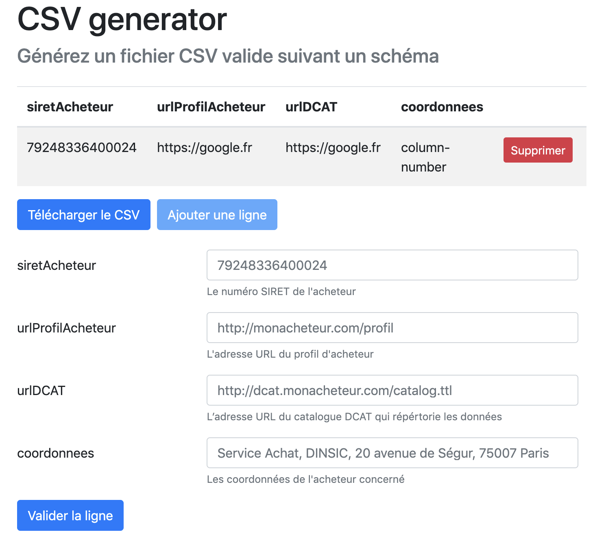

# validata-forms

This app dynamically generates a form based on a [TableSchema](https://frictionlessdata.io/specs/table-schema/) specification for a CSV file. It then uses a [Validata](https://git.opendatafrance.net/validata/) API to validate each row. The resulting CSV can be downloaded afterwards.



## Project setup
```
npm install
```

### Compiles and hot-reloads for development
```
npm run serve
```

### Compiles and minifies for production
```
npm run build
```

### Run your tests
```
npm run test
```

### Lints and fixes files
```
npm run lint
```

### Customize configuration
See [Configuration Reference](https://cli.vuejs.org/config/).
